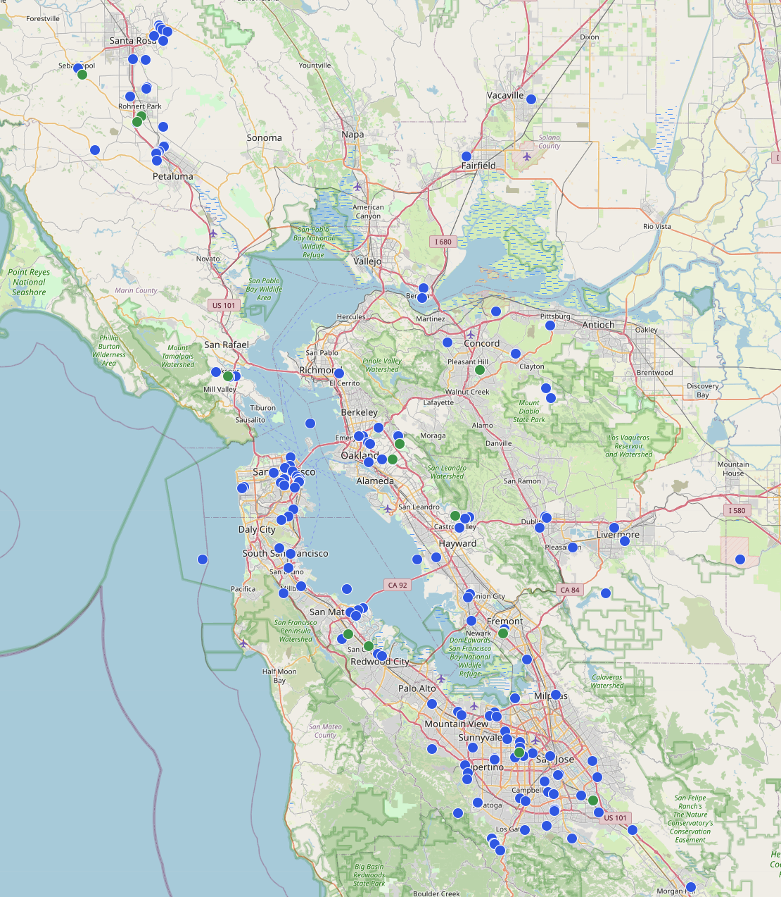

<!-- Remember to refresh this map from time to time -->

{}

    

The Bay Area is a large area but with a large community of users. If you see a dot near your area, then there is already someone active in the Bay Mesh there. If there isn't a dot in you area, we'd strongly encourage you to join us and become part of the mesh!

 To see the "real time" map try:
* [Meshtastic Map by Liam Cottle](https://meshtastic.liamcottle.net/?lat=37.83034660061394&lng=237.83271789550784&zoom=10#)
* [Meshmap.net](https://meshmap.net/)

For data and views on mesh information:
* [Bay Mesh Explorer](https://app.bayme.sh/) - Just enter your node info in the search box. It'll provide you a brief overview of the info from the mesh.
* [Meshview](https://meshview.bayme.sh/) - This allows you to drill way down into all things seen on the mesh (that reach the internet). Search for your node. It'll show you node info, graphs of power, neighbors, and environmental telementry. Also you'll see ALL packets sent/recieved by this node along with all uplinked packets (if on MQTT).

{}
